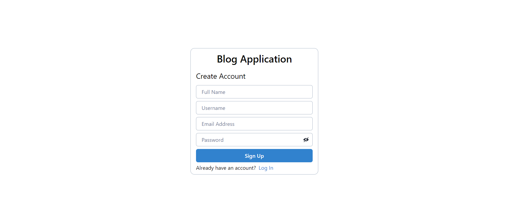
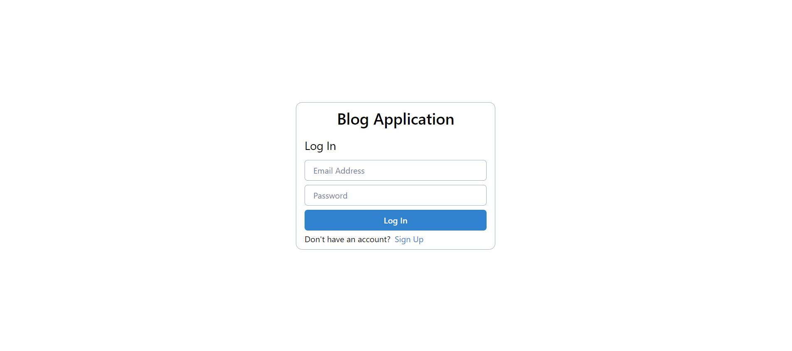
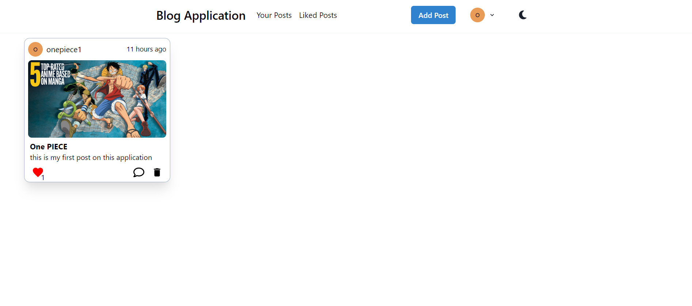
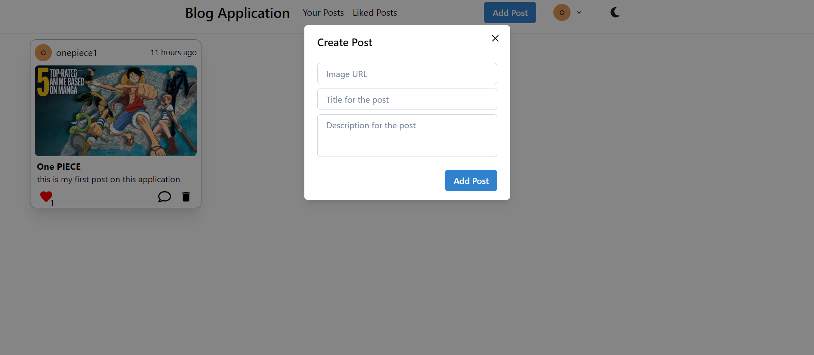

# Blog Application using React, Firebase and Chakra UI

## Sign Up Page

## Login Page

If you don't have an account you will be able to create a new one or if you have an account you will be able to login with that account.

After you create new account or after you are logged in you will see home page.

## Home Page

- You will be able to change dark and light mode, also you have pages for the posts that you created and the posts that you liked.
- You will also be able to like other people's posts and to comment on their posts.
- User who created the post will be able to delete that post.

- In order to be able to create post you need to have imageURL, title and description for that post.